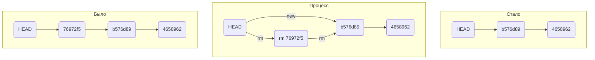

# Как откатиться назад, если «всё сломалось»

На разных этапах работы с Git могут происходить похожие ситуации:

* В список на коммит попал лишний файл (например, временный). Нужно «вынуть» его из списка.

* Последние несколько коммитов ошибочные: например, сделали не то, что было нужно, или нарушили логику. Хочется «откатить» сразу несколько коммитов, вернуть «как было вчера».

* Случайно изменился файл, который вообще не должен был меняться. Например, вы открыли не тот файл в редакторе и начали его исправлять.

В этом уроке рассмотрим такие случаи и научим вас «откатывать» нежелательные изменения.

## Выполнить unstage изменений — git restore --staged <file>

Допустим, вы создали или изменили какой-то файл и добавили его в список «на коммит» (staging area) с помощью git add, но потом передумали включать его туда. Убрать файл из staging поможет команда _git restore --staged <file>_ (от англ. restore — «восстановить»).

*💡 В выводе команды git status есть подсказка в скобках: use "git restore --staged <file>..." to unstage. Так что, даже если вы и забыли эту команду, Git напомнит вам.*

В терминале это будет выглядеть примерно так.

```
$ touch example.txt # создали ненужный файл
$ git add example.txt # добавили его в staged

$ git status # проверили статус
Changes to be committed:
  (use "git restore --staged <file>..." to unstage)
        new file:   example.txt

$ git restore --staged example.txt
$ git status # проверили статус

Untracked files:
  (use "git add <file>..." to include in what will be committed)
        example.txt

no changes added to commit (use "git add" and/or "git commit -a")
# файл example.txt из staged вернулся обратно в untracked 
```

Вызов git restore --staged example.txt перевёл example.txt из staged обратно в untracked.

Чтобы «сбросить» все файлы из staged обратно в untracked/modified, можно воспользоваться командой _git restore --staged_ .: она сбросит всю текущую папку (.).

*💡 Раньше для этой операции использовали команду git reset HEAD. Но git reset «перегруженная»: она умеет делать много разных действий в зависимости от переданных параметров. Чтобы было меньше путаницы, в Git была добавлена отдельная команда git restore.*

## «Откатить» коммит — git reset --hard <commit hash>

Иногда нужно «откатить» то, что уже было закоммичено, то есть вернуть состояние репозитория к более раннему. Для этого используют команду git reset --hard <commit hash> (от англ. reset — «сброс», «обнуление» и hard — «суровый»).

```
$ git log --oneline # хеш можно найти в истории
7b972f5 (HEAD -> master) style: добавить комментарии, расставить отступы
b576d89 feat: добавить массив Expenses и цикл для добавления трат # вот сюда и вернёмся
4b58962 refactor: разделить analyzeExpenses() на countSum() и saveExpenses()

$ git reset --hard b576d89
# теперь мы на этом коммите
HEAD is now at b576d89 feat: добавить массив Expenses и цикл для добавления трат 
```

Теперь коммит b576d89 стал последним: вся дальнейшая разработка будет вестись от него. Файл также вернулся к тому состоянию, в котором был в момент этого коммита. А коммит 7b972f5 Git просто удалил. Это можно проверить, снова запросив лог. Он покажет следующее.

```
$ git log --oneline
b576d89 (HEAD -> master) feat: добавить массив Expenses и цикл для добавления трат
4b58962 refactor: разделить analyzeExpenses() на countSum() и saveExpenses() 
```

Вот так схематично выглядит весь процесс «отката» с помощью git reset --hard <hash>.



_Будьте осторожны с командой git reset --hard! При удалении коммитов можно потерять что-то нужное._

## «Откатить» изменения, которые не попали ни в staging, ни в коммит, — git restore <file>

Может быть так, что вы случайно изменили файл, который не планировали. Теперь он отображается в Changes not staged for commit (modified). Чтобы вернуть всё «как было», можно выполнить команду git restore <file>.

```
# случайно изменили файл example.txt
$ git status
On branch main
Changes not staged for commit:
  (use "git add <file>..." to update what will be committed)
  (use "git restore <file>..." to discard changes in working directory)
          modified:   example.txt

$ git restore example.txt
$ git status
On branch main
nothing to commit, working tree clean 
```

Изменения в файле «откатятся» до последней версии, которая была сохранена через git commit или git add.

Ура! Теперь вы знаете, как сделать шаг назад, если что-то пошло не так. Вот о чём мы рассказали:

* Команда git restore --staged <file> переведёт файл из staged обратно в modified или untracked.

* Команда git reset --hard <commit hash> «откатит» историю до коммита с хешем <hash>. Более поздние коммиты потеряются!

* Команда git restore <file> «откатит» изменения в файле до последней сохранённой (в коммите или в staging) версии.