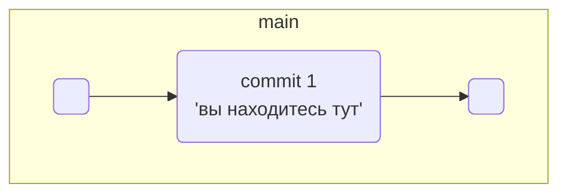
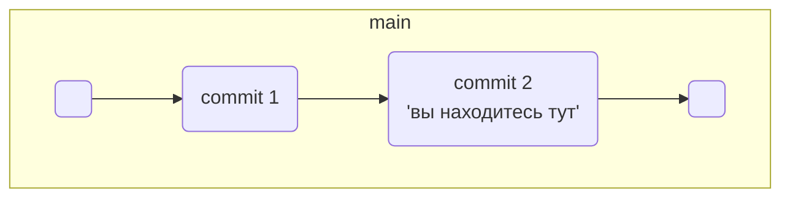
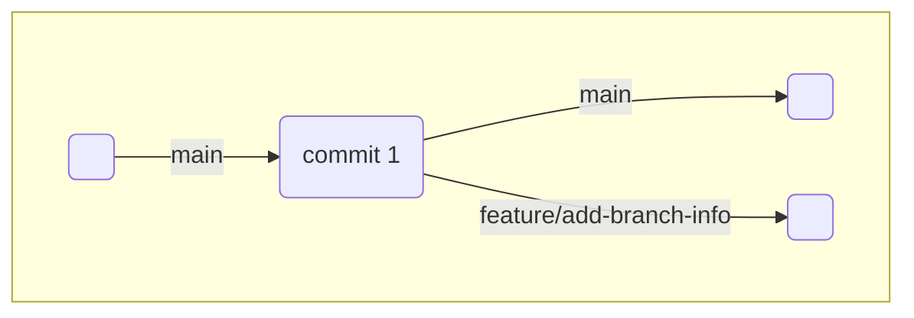

# Что такое ветка

Представьте: ваш рабочий проект запущен и у него уже появились пользователи. Вам пришла идея, как его ускорить. Но нужно провести эксперимент — изменить код и посмотреть, будет ли программа работать быстрее. В процессе важно скооперироваться с коллегами и ничего не сломать — в этом помогут ветки.

## Зачем нужны ветки

Ветка (англ. branch) — это изолированный поток разработки проекта. В таком потоке можно проверять разные идеи, тестировать новую функциональность и так далее.

Ветки позволяют экспериментировать с проектом в Git, но при этом сохранять репозиторий в стабильном состоянии. Каждый член команды может работать в своей ветке и не мешать другим: коммиты, которые он сделает, не будут видны из других веток. А когда работа будет доделана, ветки можно соединить.

Ветки полезны, даже если вы работаете в одиночку — например, над сайтом. Прежде чем писать новую функциональность, для неё следует создать отдельную ветку. Также ветки позволяют одному человеку переключаться между несколькими задачами сразу.

Основная, стабильная версия проекта хранится в главной ветке main или master. Она появляется автоматически при создании репозитория. Часто все новые ветки в репозитории отходят от main, хотя это не является правилом.

⚠️ Далее в наших примерах мы будем обозначать основную ветку как main. Обращайте на это внимание и не забывайте менять команды, если ваша ветка называется master.

## Просмотреть ветки проекта — git branch

Теперь покажем, как получить список веток проекта. Создайте тестовый проект learn_branches. Добавьте в него файл README.md, проиндексируйте изменения и сделайте коммит: git commit -m "Выполнить первый коммит".

Вспомните, что несколько команд можно объединять в одной строке терминала символом логического «и» — &&.

```
$ mkdir learn_branches && cd learn_branches && git init # создали новый репозиторий
$ touch README.md # создали файл

$ git add . # команда git add с флагом-точкой подготовит к сохранению текущую папку; вместо этого можно вызвать git add --all
$ git commit -m "Выполнить первый коммит"  
```

Репозиторий создан, файлы добавлены и закоммичены. В репозитории появилась главная ветка. Это можно проверить командой для просмотра веток git branch.

```
$ git branch 
* main # мы в основной ветке

# чтобы выйти из просмотра веток, может понадобиться Q! 
```

При вызове git branch выводятся ветки, которые есть в проекте. Звёздочкой (*) отмечено, в какой ветке вы находитесь в текущий момент.

Сейчас проект learn_branches выглядит так.



## Дополняем ветку

Добавьте в README.md следующий текст.

```
# Описание

Это проект по изучению работы с ветками 
```

Сделайте ещё один коммит.

```
$ git add . && git commit -m "Обновить README" 
```

Как и предыдущий, этот коммит сохранится внутри главной ветки. Схематически это выглядит так.



Теперь у вас есть два коммита — последовательность изменений. А это уже целая ветка!

Замечательно! Ваше знакомство с ветками состоялось, и постепенно вы узнаете о них ещё больше. Коротко подытожим:

* Ветка — это последовательность независимых изменений.

* Благодаря веткам несколько человек могут работать над одним репозиторием и не мешать друг другу. А ещё ветки помогают декомпозировать большую и страшную задачу на маленькие и понятные.

* Основная версия проекта хранится в главной ветке main (или master).

* С помощью команды git branch можно посмотреть, какие в проекте есть ветки и в какой из них вы сейчас находитесь.

# Создаём ветку

Вы узнали, что такое ветки и зачем они нужны. В ветках можно экспериментировать с проектом, не боясь что-либо поломать или помешать другим членам команды. А можно разделить крупную задачу на несколько небольших и работать независимо.

Но чтобы начать работу в отдельной ветке, её нужно создать. Самое время научиться это делать!

## Создать ветку — git branch <название_ветки>

Инициализируйте новый тестовый проект git-branches и создайте в нём файл README.md. Откройте файл и добавьте туда следующий текст.

```
# Ветки в Git  
```

Добавьте изменения в staging area и сделайте коммит с сообщением: git add . && git commit -m "Добавить файл README". 

Для создания веток в Git есть команда git branch с параметром в виде названия ветки: git branch <название_ветки>. Например, создадим ветку с названием feature/add-branch-info.

### 💡 В названии ветки есть слеш — что это значит?

Название ветки в Git может состоять из букв, цифр, а также включать любой из четырёх символов: ., -, _, /. Эти символы не несут особого смысла. Например, ветка feature/add-branch-info могла бы называться feature_add-branch-info или feature-add-branch. Обратите внимание, что ветки не образуют иерархии, как директории, разделённые символом /.

Чтобы создать ветку feature/add-branch-info, выполните команду git branch feature/add-branch-info. Затем выполните git branch, чтобы посмотреть список всех веток проекта.

```
$ git branch feature/add-branch-info # создали ветку feature/add-branch-info
$ git branch # посмотрели ветки
  
  feature/add-branch-info  # появилась новая
* main                     # * значит, что мы находимся в основной ветке
```

Готово! Сейчас в вашем репозитории две ветки — основная и feature/add-branch-info.



## Как назвать новую ветку

Есть разные подходы к наименованию веток. Каждая команда разработки выбирает свой. Но независимо от подхода ветки нужно называть так, чтобы другим участникам было понятно, что в них происходит.

Мы будем использовать указатели feature (англ. «особенность», «деталь») для веток, где прорабатывается новая функциональность, и bugfix (от англ. bug — «жук», «ошибка» и fix — «исправить») для веток, где ведётся работа по исправлению ошибок.

После ключевого слова идёт слеш и описание проблемы или задачи (например, /add-branch-info). Это описание не должно содержать пробелов — следует использовать нижнее подчёркивание или дефис. В наших примерах мы будем использовать дефис.

Хорошо! Теперь вы умеете создавать ветки с помощью команды git branch <название_ветки>. Ветки в Git — удобный инструмент. В каждой может быть сколько угодно коммитов, а когда работа будет сделана, останется только объединить их.

# Шагаем с ветки на ветку

Допустим, вы создали ветку для экспериментов с вашим рабочим проектом. Чтобы поработать в ней, сначала вам нужно на неё переключиться.

Например, в прошлом уроке вы создали ветку feature/add-branch-info, но пока по-прежнему находитесь в main (или master). Пора это исправить и научиться перемещаться между ветками!

## Переключиться на другую ветку — git checkout <название_ветки>

Чтобы начать работу в feature/add-branch-info, перейдите в неё с помощью команды git checkout с флагом — названием ветки: git checkout feature/add-branch-info.

```
$ git checkout feature/add-branch-info # перешли в новую ветку
Switched to branch 'feature/add-branch-info'

$ git branch # проверили

* feature/add-branch-info # теперь находимся тут
  main 
```

Строчка Switched to branch... (англ. «переключено на ветку…») сообщает, на какую ветку вы только что переключились.

Откройте файл README.md и добавьте в него информацию о командах git branch и git checkout. Получится следующее.

```
# Ветки в Git 

Чтобы создать ветку, необходимо выполнить команду `git branch %BRANCH_NAME%`.

Для перехода в ветку есть команда `git checkout %BRANCH_NAME%`. 
```

Добавьте изменения в staging area и сделайте коммит с сообщением: git add . && git commit -m "Добавить git branch и git checkout в README".


Теперь вернитесь в главную ветку командой git checkout main (или git checkout master в зависимости от настроек вашей системы) и откройте файл README.md. В нём отобразится только первоначальный текст, который вы добавили в прошлом уроке. Все изменения сохранились в ветку feature/add-branch-info, а состояние главной ветки не изменилось.

## Создать ветку и сразу переключиться на неё — git checkout -b <название_ветки>

Можно создать ветку и сразу начать в ней работать. За это отвечает команда git checkout с флагом -b (от англ. branch) и названием ветки. Эта команда делает то же самое, что и последовательность команд git branch %название-ветки% && git checkout %название-ветки%.

Убедитесь, что вы в основной ветке. Затем создайте ещё одну ветку для исправления ошибок bugfix/fix-branch и сразу переключитесь на неё.

```
$ git checkout main
$ git checkout -b bugfix/fix-branch # создали ветку и сразу на неё переключились
Switched to a new branch 'bugfix/fix-branch'

$ git branch
* bugfix/fix-branch # сразу в нужной ветке
  feature/add-branch-info
  main 
```

Строчка Switched to a new branch... (англ. «переключено на новую ветку…») сообщает о том, что вы переключились на только что созданную ветку. 


## На какой коммит указывает bugfix/fix-branch

Ветка в Git — это указатель на коммит. Когда вы делаете новый коммит в ветке, этот указатель передвигается вперёд.

Пока вы не вносили новые коммиты в ветку bugfix/fix-branch, поэтому она указывает на тот же коммит, что и основная ветка. Убедитесь в этом с помощью команды git log --oneline.

```
$ git checkout bugfix/fix-branch
$ git log --oneline
a7eb909 (HEAD -> bugfix/fix-branch, main) Добавить файл README

$ git checkout feature/add-branch-info
$ git log --oneline
abd591c (HEAD -> feature/add-branch-info) Добавить git branch и git checkout в README
a7eb909 (main, bugfix/fix-branch) Добавить файл README 
```

Так что можно показать текущее состояние проекта git-branches так: поместить названия веток над коммитами, на которые они указывают.


### Путешествие по веткам было головокружительным! Вот самое важное, о чём мы рассказали:

* Команда git checkout <название_ветки> позволяет переключаться на другую ветку.

* Разные ветки в одном проекте существуют независимо. Изменения в одной не влияют на изменения в другой.

* В Git можно создать ветку и сразу же перейти в неё командой git checkout -b <название_ветки>.

* Ветка указывает на коммит, который сделан в ней последним. При этом две ветки могут ссылаться на один и тот же коммит — например, если вы только что создали ветку, но ещё не успели внести в неё коммит.