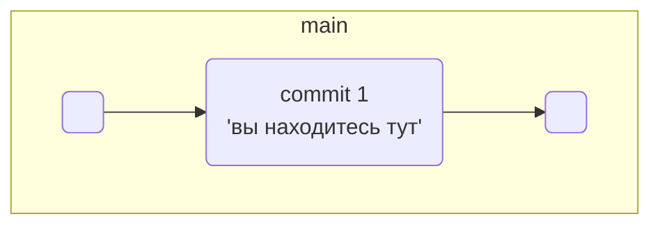
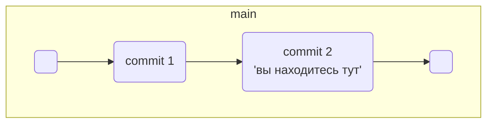

# Что такое ветка

Представьте: ваш рабочий проект запущен и у него уже появились пользователи. Вам пришла идея, как его ускорить. Но нужно провести эксперимент — изменить код и посмотреть, будет ли программа работать быстрее. В процессе важно скооперироваться с коллегами и ничего не сломать — в этом помогут ветки.

## Зачем нужны ветки

Ветка (англ. branch) — это изолированный поток разработки проекта. В таком потоке можно проверять разные идеи, тестировать новую функциональность и так далее.

Ветки позволяют экспериментировать с проектом в Git, но при этом сохранять репозиторий в стабильном состоянии. Каждый член команды может работать в своей ветке и не мешать другим: коммиты, которые он сделает, не будут видны из других веток. А когда работа будет доделана, ветки можно соединить.

Ветки полезны, даже если вы работаете в одиночку — например, над сайтом. Прежде чем писать новую функциональность, для неё следует создать отдельную ветку. Также ветки позволяют одному человеку переключаться между несколькими задачами сразу.

Основная, стабильная версия проекта хранится в главной ветке main или master. Она появляется автоматически при создании репозитория. Часто все новые ветки в репозитории отходят от main, хотя это не является правилом.

⚠️ Далее в наших примерах мы будем обозначать основную ветку как main. Обращайте на это внимание и не забывайте менять команды, если ваша ветка называется master.

## Просмотреть ветки проекта — git branch

Теперь покажем, как получить список веток проекта. Создайте тестовый проект learn_branches. Добавьте в него файл README.md, проиндексируйте изменения и сделайте коммит: git commit -m "Выполнить первый коммит".

Вспомните, что несколько команд можно объединять в одной строке терминала символом логического «и» — &&.

```
$ mkdir learn_branches && cd learn_branches && git init # создали новый репозиторий
$ touch README.md # создали файл

$ git add . # команда git add с флагом-точкой подготовит к сохранению текущую папку; вместо этого можно вызвать git add --all
$ git commit -m "Выполнить первый коммит"  
```

Репозиторий создан, файлы добавлены и закоммичены. В репозитории появилась главная ветка. Это можно проверить командой для просмотра веток git branch.

```
$ git branch 
* main # мы в основной ветке

# чтобы выйти из просмотра веток, может понадобиться Q! 
```

При вызове git branch выводятся ветки, которые есть в проекте. Звёздочкой (*) отмечено, в какой ветке вы находитесь в текущий момент.

Сейчас проект learn_branches выглядит так.



## Дополняем ветку

Добавьте в README.md следующий текст.

```
# Описание

Это проект по изучению работы с ветками 
```

Сделайте ещё один коммит.

```
$ git add . && git commit -m "Обновить README" 
```

Как и предыдущий, этот коммит сохранится внутри главной ветки. Схематически это выглядит так.



Теперь у вас есть два коммита — последовательность изменений. А это уже целая ветка!

Замечательно! Ваше знакомство с ветками состоялось, и постепенно вы узнаете о них ещё больше. Коротко подытожим:

* Ветка — это последовательность независимых изменений.

* Благодаря веткам несколько человек могут работать над одним репозиторием и не мешать друг другу. А ещё ветки помогают декомпозировать большую и страшную задачу на маленькие и понятные.

* Основная версия проекта хранится в главной ветке main (или master).

* С помощью команды git branch можно посмотреть, какие в проекте есть ветки и в какой из них вы сейчас находитесь.