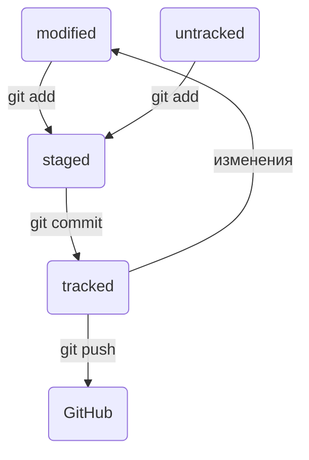

# Статусы untracked/tracked, staged и modified

Одна из ключевых задач Git — отслеживать изменения файлов в репозитории. Для этого каждый файл помечается каким-либо статусом. Рассмотрим основные.

## untracked (англ. «неотслеживаемый»)

Мы говорили, что новые файлы в Git-репозитории помечаются как untracked, то есть неотслеживаемые. Git «видит», что такой файл существует, но не следит за изменениями в нём. У untracked-файла нет предыдущих версий, зафиксированных в коммитах или через команду git add.

## staged (англ. «подготовленный»)

После выполнения команды git add файл попадает в staging area (от англ. stage — «сцена», «этап [процесса]» и area — «область»), то есть в список файлов, которые войдут в коммит. В этот момент файл находится в состоянии staged.

В одном из предыдущих уроков мы сравнили коммит с фотографией. Можно развить эту аналогию и сказать, что команда git add добавляет персонажей (текущее содержимое файла или нескольких файлов) на сцену (англ. stage) для общей фотографии, а git commit делает снимок всей сцены целиком.

## 💡 Staging area, index и cache

Staging area также называют index (англ. «каталог») или cache (англ. «кеш»), а состояние файла staged иногда называют indexed или cached.

Все три варианта могут встречаться в документации и в качестве флагов команд Git. А также в интернете — например, в вопросах и ответах на сайте Stack Overflow.

## tracked (англ. «отслеживаемый»)

Состояние tracked — это противоположность untracked. Оно довольно широкое по смыслу: в него попадают файлы, которые уже были зафиксированы с помощью git commit, а также файлы, которые были добавлены в staging area командой git add. То есть все файлы, в которых Git так или иначе отслеживает изменения.

## modified (англ. «изменённый»)

Состояние modified означает, что Git сравнил содержимое файла с последней сохранённой версией и нашёл отличия. Например, файл был закоммичен и после этого изменён.

💡 Для файлов в состояниях staged и modified обычно не указывают, что они также tracked, потому что это состояние подразумевается.

# Про staged и modified

Команда git add добавляет в staging area только текущее содержимое файла. Если вы, например, сделаете git add file.txt, а затем измените file.txt, то новое содержимое файла не будет находиться в staging.

Git сообщит об этом с помощью статуса modified: файл изменён относительно той версии, которая уже в staging. Чтобы добавить в staging последнюю версию, нужно выполнить git add file.txt ещё раз.

# Типичный жизненный цикл файла в Git

Может показаться, что файлы в репозитории попадают в разные состояния хаотично. На практике это не так, и у большинства файлов вполне предсказуемый путь.

1. Файл только что создали. Git ещё не отслеживает содержимое этого файла. Состояние: untracked.

2. Файл добавили в staging area с помощью git add. Состояние: staged (+ tracked).

3. Возможно, изменили файл ещё раз. Состояния: staged, modified (+ tracked). Обратите внимание: staged и modified у одного файла, но у разных его версий.

3. Ещё раз выполнили git add. Состояние: staged (+ tracked).

4. Сделали коммит с помощью git commit. Состояние: tracked.

5. Изменили файл. Состояние: modified (+ tracked).

6. Снова добавили в staging area с помощью git add. Состояния: staged (+ tracked).

7. Сделали коммит. Состояния: tracked.

8. Повторили пункты 4−74-74−7 много-много раз.

Выглядит довольно запутанно! Но на практике разобраться с этим будет проще, чем кажется. Вы сможете наглядно проследить типичный жизненный цикл файла в Git в следующем уроке.